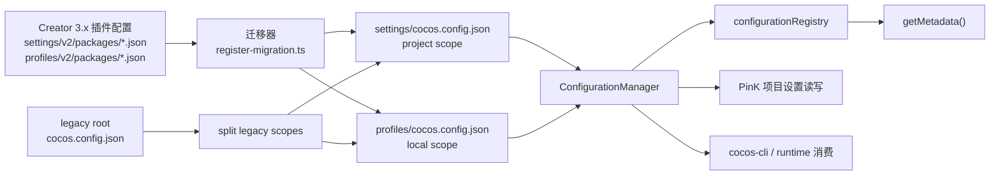

# Creator 3.x 配置迁移设计

更新时间：2026-07-24

本文说明 Creator 3.x 项目配置在 cocos-cli / PinK 中的迁移边界。它也作为 AI 编码上下文，避免后续把旧 Creator 配置或项目根目录的 legacy 配置误判为当前配置真相源。

## 结论

- cocos-cli / PinK 的项目配置真相源是 `<project>/settings/cocos.config.json`。
- cocos-cli / PinK 的本地/个人配置真相源是 `<project>/profiles/cocos.config.json`。
- 项目根目录的 `<project>/cocos.config.json` 仅作为 legacy 输入兼容：首次加载时拆分到 `settings/` 与 `profiles/` 后删除，不能再作为读写目标。
- Creator 3.x 的 `settings/v2/packages/*.json`、`profiles/v2/packages/*.json` 属于旧插件配置系统，只作为迁移输入。
- PinK 打开项目或独立 cocos-cli MCP server 启动时，会初始化配置系统，并在需要时把旧 Creator 配置迁移到新的 `settings/` 与 `profiles/` 配置文件。
- 不做反写、双写或旧 Creator 3.x 反向兼容。新系统兼容老项目靠迁移，Creator 不需要理解新配置。

## 架构

核心职责：

- `CocosConfigLoader` 只负责读取 Creator 3.x 旧插件配置。
- `register-migration.ts` 只负责把旧结构映射到新结构，并通过 `sourceScope` / `targetScope` 决定写入 project 或 local。
- `ConfigurationManager` 负责加载、保存、版本判断和持久化 `settings/cocos.config.json` 与 `profiles/cocos.config.json`。
- `configurationRegistry` 负责收集各模块注册的默认值和 metadata。
- 运行时逻辑应消费配置系统中的 key，而不是回读 Creator 旧插件配置或根目录 legacy 配置。

## 迁移规则

- 初次打开老项目时，如果配置不存在或版本低于当前配置版本，可以执行迁移。
- Creator `sourceScope: local` 的迁移默认写入 CLI local scope，也就是 `profiles/cocos.config.json`；如需写入 project，必须显式配置 `targetScope: 'project'`。
- Creator project/global 来源默认写入 CLI project scope，也就是 `settings/cocos.config.json`。
- 如果发现根目录 `cocos.config.json`，只做一次兼容读取：把本地/个人键拆到 `profiles/cocos.config.json`，其余项目键写到 `settings/cocos.config.json`，然后删除根文件。
- 后续版本已经满足要求时，不再自动从旧 Creator 配置重新导入，避免旧值覆盖新系统中的用户修改。
- 用户明确执行重新迁移时，应理解为一次覆盖性导入操作，而不是 Creator 3.x 兼容机制。

常见映射：

| 来源 | 目标 |
| --- | --- |
| `settings/v2/packages/project.json` 的 `general.designResolution` | `settings/cocos.config.json` 的 `engine.designResolution` |
| `settings/v2/packages/project.json` 的 `script` | `settings/cocos.config.json` 的 `script` |
| `settings/v2/packages/project.json` 的 `physics` | `settings/cocos.config.json` 的 `engine.physicsConfig` |
| `settings/v2/packages/engine.json` 的 `macroConfig` | `settings/cocos.config.json` 的 `engine.macroConfig` |
| `settings/v2/packages/engine.json` 的 `modules.configs` | `settings/cocos.config.json` 的 `engine.configs` |
| `settings/v2/packages/builder.json` 的构建项目配置 | `settings/cocos.config.json` 的 `builder` |
| `profiles/v2/packages/builder.json` 的本地构建偏好 | `profiles/cocos.config.json` 的 `builder.common` |
| `profiles/v2/packages/web-desktop.json` / `web-mobile.json` | `profiles/cocos.config.json` 的 `builder.platforms.*` |
| legacy root `scene.camera` / `scene.gizmo` / `scene.sceneView` | `profiles/cocos.config.json` 的 `scene.*` |

## 编码准则

1. 不要把 `settings/v2/packages/*.json` 或 `profiles/v2/packages/*.json` 当作 cocos-cli / PinK 当前配置源。
2. 不要新增把新配置反写到 Creator 3.x 旧插件配置的逻辑。
3. 不要新增读取或写入项目根目录 `cocos.config.json` 的正常路径；根文件只允许在 legacy relocation 中读取并删除。
4. 新增配置时，在所属业务模块注册默认值和 metadata，不维护中心化静态快照。
5. 配置 UI、CLI API、运行时消费点都应读写配置系统 key；需要磁盘路径时通过 `configurationManager.getConfigPath(scope)` 获取。
6. 修复配置不生效问题时，优先检查：
   - metadata key 是否正确；
   - UI 是否通过配置系统写入；
   - project/local scope 是否正确；
   - `settings/cocos.config.json` 或 `profiles/cocos.config.json` 是否保存成功；
   - 运行时是否读取了新配置 key；
   - 迁移映射是否覆盖旧配置来源。

## 非目标

- 不保证 Creator 3.x 项目设置界面能显示 PinK / cocos-cli 修改后的配置。
- 不保证迁移后的项目配置还能由 Creator 3.x 继续编辑。
- 不把 `settings/v2/packages/*.json` 或 `profiles/v2/packages/*.json` 作为 PinK 项目设置写入目标。
- 不通过反写 Creator 旧配置来修复新配置系统的消费链路问题。

## 相关文件

- `src/core/configuration/script/manager.ts`
- `src/core/configuration/migration/cocos-config-loader.ts`
- `src/core/configuration/migration/register-migration.ts`
- `src/api/configuration/configuration.ts`
- `src/lib/configuration/configuration.ts`
- `docs/dev/config-metadata-plan.md`
- `src/core/configuration/README.md`
- `src/core/configuration/migration/README.md`
